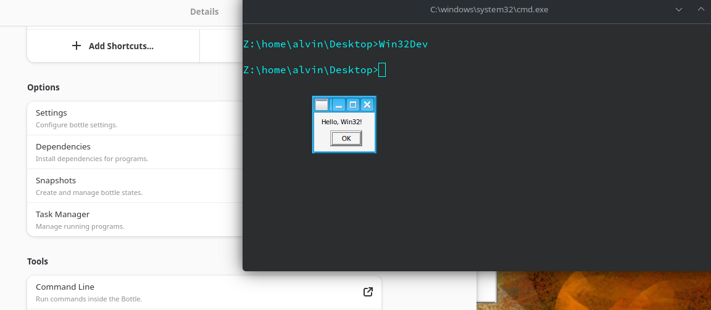

# Win32 Development Project

This project is a minimal Win32 application that displays a message box with the text "Hello, Win32!" when executed.

It serves as a starting point for developing and cross-compiling Win32 applications using CMake in a devcontainer environment.

## Project Structure

```
win32_dev
├── src
│   └── main.c
├── CMakeLists.txt
└── README.md
```

## Building the Project

To build the project, follow these steps:

```
make configure

make build
```
The exe will be generated in the `build` directory.

## Running the Application

After building the project, you can run the application by executing the generated executable (`Win32Dev.exe` on Windows). You should see a message box displaying "Hello, Win32!".

Quick way to test while still on Linux is to launch a command prompt in Bottle (or any Wine environment) and run the executable:




## Console only

The default build uses WinMain as entry, to use console mode aka 
```int main(int argc, char *argv[])```

remove "-mwindows"
in CMakeList.txt
